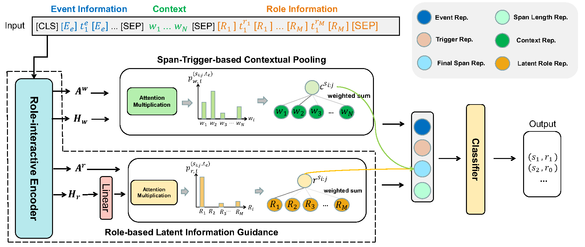

# SCPRG


Source code for Findings of ACL 2023 paper: [Enhancing Document-level Event Argument Extraction with Contextual Clues and Role Relevance](https://aclanthology.org/2023.findings-acl.817).

 Our code is based on TSAR (A Two-Stream AMR-enhanced Model for Document-level Event Argument Extraction) [here](https://github.com/RunxinXu/TSAR) and thanks for their implement.

## 🔥 Introduction

Document-level event argument extraction poses new challenges of long input and cross-sentence inference compared to its sentence-level counterpart. However, most prior works focus on capturing the relations between candidate arguments and the event trigger in each event, ignoring two crucial points: a) non-argument contextual clue information; b) the relevance among argument roles. In this paper, we propose a SCPRG (Span-trigger-based Contextual Pooling and latent Role Guidance) model, which contains two novel and effective modules for the above problem. The Span-Trigger-based Contextual Pooling (STCP) adaptively selects and aggregates the information of non-argument clue words based on the context attention weights of specific argument-trigger pairs from pre-trained model. The Role-based Latent Information Guidance (RLIG) module constructs latent role representations, makes them interact through role-interactive encoding to capture semantic relevance, and merges them into candidate arguments. Both STCP and RLIG introduce no more than 1% new parameters compared with the base model and can be easily applied to other event extraction models, which are compact and transplantable. Experiments on two public datasets show that our SCPRG outperforms previous state-of-the-art methods, with 1.13 F1 and 2.64 F1 improvements on RAMS and WikiEvents respectively. Further analyses illustrate the interpretability of our model.
You can refer to our [paper](https://aclanthology.org/2023.findings-acl.817) for more details.

<div align=center>

</div>

## 🚀 How to use our code?

### 1. Dependencies

- pytorch==1.9.0
- transformers==4.8.1
- datasets==1.8.0
- tqdm==4.49.0
- spacy==3.2.4
- opt_einsum
- wandb

  
For the usage of spacy, the following command could be helpful.

```bash
>> pip install https://github.com/explosion/spacy-models/releases/download en_core_web_sm-3.2.0/en_core_web_sm-3.2.0.tar.gz
```

### 2. Data Preprocessing

You can first download the datasets and some scripts [here](https://drive.google.com/file/d/1euuD7ST94b5smaUFo6ROLW_ZasHwDpib/view?usp=sharing).
You only need to unzip the data.zip.

Then Go to [data/wikievents](./data/wikievents) folder and run the following command, which is used to transfer the data formats.

```bash
>> python transfer.py
```

### 3. Training and Evaluation

The training scripts are provided.

```bash
>> bash run_rams_base.sh
>> bash run_rams_large.sh
>> bash run_wikievents_base.sh
>> bash run_wikievents_large.sh
```

You can change the settings in the corresponding scripts.

And you can evaluate the model by the following scripts.

```bash
>> bash evaluate_rams.sh
>> bash evaluate_wikievent.sh
```

You can download our best model checkpoint [here](https://drive.google.com/drive/folders/1hUovlrl5aRi8b84KhHS5DOg0tzT_1JyB?usp=sharing).

If you have any questions, pls contact us via liuwanlong@std.uestc.edu.cn. Thanks!

## 🌝 Citation

If you use this work or code, please kindly cite the following paper:

```bib
@inproceedings{liu2023enhancing,
  title={Enhancing Document-level Event Argument Extraction with Contextual Clues and Role Relevance},
  author={Liu, Wanlong and Cheng, Shaohuan and Zeng, Dingyi and Hong, Qu},
  booktitle={Findings of the Association for Computational Linguistics: ACL 2023},
  pages={12908--12922},
  year={2023}
}

```

